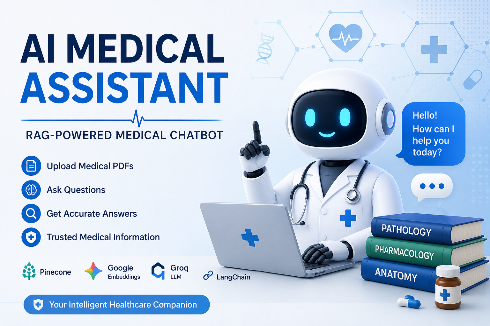

# 🩺 AI Medical Assistant — RAG Powered Chatbot



A modern AI-powered medical assistant chatbot built using:

- FastAPI
- LangChain
- Groq LLM
- Pinecone
- HuggingFace Embeddings
- HTML/CSS/JavaScript Frontend

---

# 🚀 Features

✅ Upload Medical PDFs  
✅ Ask Questions from Uploaded Documents  
✅ RAG-based Response Generation  
✅ FastAPI REST Backend  
✅ Modern HTML/CSS/JS Frontend  
✅ Pinecone Vector Search  
✅ Groq LLaMA3 Integration  
✅ Responsive UI  

---

# 🧠 RAG Workflow

```text
User Query
    ↓
Embedding Generation
    ↓
Pinecone Vector Search
    ↓
Relevant Chunks Retrieved
    ↓
LangChain RAG Chain
    ↓
Groq LLM Response
```

---

# 📁 Project Structure

```text
medical-chatbot/
│
├── backend/
├── frontend/
├── assets/
└── README.md
```

---

# ⚙️ Backend Setup

## 1. Clone Repository

```bash
git clone <repo-url>
cd medical-ai-assistant/backend
```

---

## 2. Create Virtual Environment

```bash
python -m venv venv
```

### Windows

```bash
venv\Scripts\activate
```

### Linux/Mac

```bash
source venv/bin/activate
```

---

## 3. Install Dependencies

```bash
pip install -r requirements.txt
```

---

## 4. Configure Environment Variables

Create `.env`

```env
GROQ_API_KEY=your_key
PINECONE_API_KEY=your_key
PINECONE_INDEX_NAME=medical-chatbot
PINECONE_CLOUD=aws
PINECONE_REGION=us-east-1
CORS_ORIGINS=http://localhost:5500,http://127.0.0.1:5500
MAX_UPLOAD_FILES=5
MAX_UPLOAD_BYTES=10485760
```

---

## 5. Run Backend

```bash
uvicorn app.main:app --reload
```

Backend runs on:

```text
http://localhost:8000
```

---

# 💻 Frontend Setup

```bash
cd frontend
```

Run local server:

```bash
python -m http.server 5500
```

Frontend:

```text
http://localhost:5500
```

---

# 📚 API Endpoints

## Upload PDFs

```http
POST /upload
```

Form Data:

```text
files: PDF files
```

---

## Ask Questions

```http
POST /ask
```

Body:

```json
{
  "question": "What is diabetes?"
}
```

---

# 🌐 Tech Stack

| Layer | Technology |
|---|---|
| Frontend | HTML, CSS, JavaScript |
| Backend | FastAPI |
| LLM | Groq LLaMA3 |
| Embeddings | HuggingFace BAAI/bge-base-en-v1.5 |
| Vector DB | Pinecone |
| Framework | LangChain |

---

# 🎯 Future Improvements

- Authentication
- Chat History Database
- Voice Assistant
- OCR for Medical Reports
- Multi-user Support
- Docker Deployment

---

# 📄 License

MIT License
